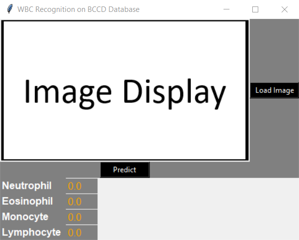

## CNN Model-based 4 types of WBC (leukocytes) Classification
The CNN model is proposed based on the __BCCD__ ([Blood Cell Count and Detection](https://github.com/Shenggan/BCCD_Dataset "BCCD")) dataset. The dataset is consisted of four types of WBC images: __Neutrophil__, __Eosinophil__, __Monocyte__ and __Lymphocyte__. The dataset is collected from [here](https://www.kaggle.com/paultimothymooney/blood-cells/ "Blood Cell Images"). The dataset is divided in two folders: __dataset-master__ and it is __dataset2-master__. The __dataset-master__ folder is contained about <b>366 JPEG</b> images with the labeling of class of each image in <b>.CSV</b> file. The <b>dataset2-master</b> folder is contained <b>12444 augmented</b> images. To train the proposed CNN model, the above dataset is refined in such a way so that the model cannot be trained by any unusual WBC image.

First, the WBC images of <b>dataset-master</b> folder are examined and 15 images are found that are contained 2 WBCs. These 15 images are removed from the dataset. Because, there have no location-based exact indication of the class of 2 WBCs contained images in the <b>.CSV</b> file. Besides, there are 3 Basophil type WBC image. As <b>Basophil</b> type WBC image is out of consideration for this work, so those <b>3 Basophil</b> type WBC images are also removed. And also, 1 Monocyte type WBC image (<i>BloodImage_00116.jpg</i>) is missing in the <b>JPEGImages</b> folder, although the image is mentioned in <b>.CSV</b> file. So in total, `366-15-3-1 = 347` WBC images are considered from <b>dataset-master</b> folder.

As the second step, the augmented WBC images are examined for <b>dataset2-master</b> folder. Because of the augmentation, there are 27 WBC images that do not have full field of view of WBC nucleus. Among them, Neutrophil type WBCs are 22 and Lymphocyte type WBCs are 5. Some of them are shown below:
<table>
  <tr align="center" valign="center">
    <td><ins>Neutrophil</ins></td>
    <td><ins>Neutrophil</ins></td>
    <td><ins>Lymphocyte</ins></td>
    <td><ins>Lymphocyte</ins></td>
  </tr>
  <tr align="center" valign="center">
    <td></td>
    <td></td>
    <td></td>
    <td></td>
  </tr>
</table>

These 27 images can be found in the <b>augmented_wbc_won</b> folder. So, in total, `12444-22-5 = 12417` augmented WBC images are considered.  <b>Table-1</b> (for training) and <b>Table-2</b> (for testing) show the number of <b>original<b> and <b>augmented BCCD</b> WBC images that are considered for training and testing the proposed CNN model in this [manuscript](https://www.sciencedirect.com/science/article/abs/pii/S0957417420300373 "An Automatic Nucleus Segmentation and CNN Model based Classification Method of White Blood Cell").

---
Table-1: <b>Training</b>
 
| Types of WBC | Original | Augmented | Total |
| ------------ | -------- | --------- | ----- |
| Eosinophil	  | 75       | 2497      | 2572  |
| Neutrophil	  | 158      | 2499-22   | 2635  |
| Monocyte	    | 16       | 2478      | 2494  |
| Lymphocyte	  | 27       | 2483-5    | 2505  |
| <b>Total</b> | 276      | 9957      | 10206 |
---
 

Table-2: __Testing__
 
| Types of WBC | Original | Augmented | Total |
| ------------ | -------- | --------- | ----- |
Eosinophil	    | 13       | 623       | 636   | 
Neutrophil	    | 48       | 624       | 672   |
Monocyte	      | 4        | 620       | 624   |
Lymphocyte	    | 6        | 620       | 626   |
| __Total__    | 71       | 2487      | 2558  |
---
 

* The considered WBC images can be found in the <b>bccd_wbc_seg</b> folder. The folder is divided in <b>TRAIN</b> and <b>TEST</b> subfolder. The <b>TRAIN</b> and <b>TEST</b> subfolders, each of them are divided in 4 subfolders, named as the type of WBC.
* From <b>bccd_wbc_seg</b> folder, the <b>.npz</b> file is generated by running the code of the file `npzfile_gen_bccdwbc_seg.ipynb`. In <b>.npz</b> file, the resolution of RGB WBC images is `80x80`. This <b>.npz</b> file is useful because, the dataset can be loaded once into the memory (RAM) which helps to train the CNN model more faster.
* After generating the `eswa_train_test_bccdwbc_seg_80x80.npz` file, the proposed CNN model is trained by using the train data of the <b>.npz</b> file. The structure of the proposed CNN model is shown here:
<table>
  <tr align="center" valign="center">
    <td><ins>Proposed CNN Model for BCCD Dataset</ins></td>
  </tr>
  <tr align="center" valign="center">
    <td></td>
  </tr>
</table>

* After finishing the training of the proposed CNN model, the trained model is tested on the test data of <b>.npz</b> file. The training and testing code of the proposed trained CNN model can be found in `eswa_training_bccdwbc_cnn_model_2020.ipynb` and `eswa_testing_bccdwbc_cnn_model_2020.ipynb` file. The proposed CNN model, trained model weights, and training checkpoints are generated during the training of the CNN model and they are named as `eswa_bccdwbc_cnn_model.json`, `eswa_bccdwbc_cnn_weights.hdf5`, and `eswa_bccdwbc_cnn_training_logs.npy`.
* To infer the trained CNN model for more WBC images, an executable <b>.EXE</b> file (`eswa_bccdwbc_recog.exe`) is generated in <b>App</b> folder. The app takes the WBC image as input (<i>any resolution but localized and cropped WBC image</i>), displays the WBC image and show the prediction score (of 4 classes) of the input WBC image. Here are the screenshots of launching and inference display of app:
<table>
  <tr align="center" valign="center">
    <td><ins>App Launching Display</ins></td>
    <td><ins>App Inference Display</ins></td>
  </tr>
  <tr align="center" valign="center">
    <td></td>
    <td></td>
  </tr>
</table>
 
>Note: __The details of the proposed CNN model can be found in this [manuscript](https://www.sciencedirect.com/science/article/abs/pii/S0957417420300373 "An Automatic Nucleus Segmentation and CNN Model based Classification Method of White Blood Cell"). Please take a look on it__.